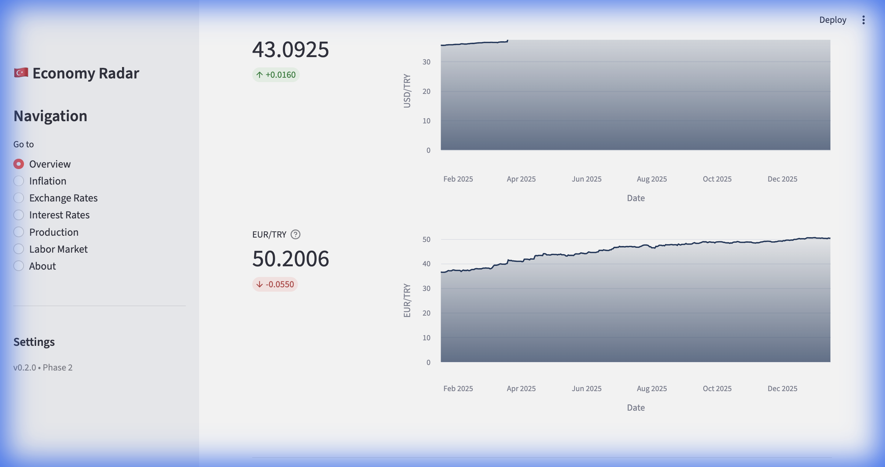

# 🇹🇷 Turkish Macroeconomic Dashboard

**Turkish Macroeconomic Dashboard** is a real-time analytics tool designed to track, visualize, and analyze key indicators of the Turkish economy. Built with Streamlit and Python, it fetches data directly from the **Central Bank of the Republic of Turkey (TCMB) EVDS API**.




## 🚀 Features

*   **Executive Overview**: A high-level summary of Inflation, Exchange Rates, Interest Rates, Production, and Labor Market metrics with 1-year trend charts.
*   **Inflation Tracker**: Detailed breakdown of CPA (Consumer Price Index) with YoY and MoM calculations.
*   **Exchange Rates**: Real-time tracking of USD/TRY and EUR/TRY with gradient area charts.
*   **Monetary Policy**: Monitoring of the "Weighted Average Funding Cost" as a high-fidelity proxy for the TCMB Policy Rate.
*   **Real Sector**: Capacity Utilization Rates for the Manufacturing Industry.
*   **Labor Market**: Seasonally adjusted Unemployment and Labor Force Participation rates.

## 🛠️ Tech Stack

*   **Frontend**: [Streamlit](https://streamlit.io/)
*   **Data Processing**: Pandas, NumPy
*   **Visualization**: Altair, Plotly Express
*   **Data Source**: TCMB EVDS API

## ⚙️ Installation & Setup

1.  **Clone the repository**:
    ```bash
    git clone https://github.com/yourusername/turkey-economy-radar.git
    cd turkey-economy-radar
    ```

2.  **Create a virtual environment** (Recommended):
    ```bash
    python -m venv .venv
    source .venv/bin/activate  # On Windows: .venv\Scripts\activate
    ```

3.  **Install dependencies**:
    ```bash
    pip install -r requirements.txt
    ```

4.  **Configure API Key**:
    *   Get a free API key from [TCMB EVDS](https://evds2.tcmb.gov.tr/).
    *   Create a `.env` file in the root directory:
        ```bash
        cp .env.example .env
        ```
    *   Add your key:
        ```
        TCMB_API_KEY=your_api_key_here
        ```

5.  **Run the application**:
    ```bash
    streamlit run app.py
    ```

## 📂 Project Structure

```
turkey-economy-radar/
├── app.py                 # Main entry point
├── config/                # Configuration and settings
├── components/            # UI components (Inflation, Labor, etc.)
├── data/
│   └── fetchers/          # TCMB API Client and adapters
├── assets/                # Images and static files
├── requirements.txt       # Python dependencies
└── .env                   # Environment variables (Ignored by Git)
```

## ℹ️ Methodology

*   **Interest Rates**: Due to API restrictions on the direct Policy Rate series (`TP.PY.P01`), this dashboard uses `TP.APIFON4` (Weighted Average Funding Cost). This rate historically tracks the 1-Week Repo Auction Rate very closely and serves as an effective real-time proxy for monetary stance.
*   **Data Latency**: Data is fetched in real-time. Usage of cached functions (`@st.cache_data`) ensures performance while respecting API limits.

## 🤝 Contributing

Contributions are welcome! Please feel free to submit a Pull Request.

## 📜 License

This project is open-source.

---
**Created by b. yusuf coban** | v0.2.0
